# hass-magic-caster-wand-fx
[](https://hacs.xyz/)
[](https://github.com/L-Milko/hass-magic-caster-wand-fx/releases)
[](https://github.com/L-Milko/hass-magic-caster-wand-fx/blob/main/LICENSE)


Magic Caster Wand FX is a Home Assistant custom integration for Magic Caster Wand Bluetooth control, WebGL fluid spell visuals, finger or mouse spell casting, and multi-wand play.

This fork uses the separate Home Assistant domain `magic_caster_wand_fluid`, so it can be installed without overlapping the original `magic_caster_wand` integration.

## Supported Models

- Loyal
- Honourable
- Defiant

## Installation

1. Install with HACS as a custom repository: `https://github.com/L-Milko/hass-magic-caster-wand-fx`.
2. Select category `Integration`.
3. Restart Home Assistant after installing or updating.
4. Add the integration from **Settings -> Devices & services -> Add integration -> Magic Caster Wand FX**.

If installing manually, copy this repository's `custom_components/magic_caster_wand_fluid` folder into Home Assistant's `/config/custom_components/magic_caster_wand_fluid` folder.

## Important Bluetooth Notes

- A Bluetooth proxy is strongly recommended for stable range and multiple wands.
- `bluetooth_proxy` should use `active: true`.
- Keep scan interval at the default unless you are troubleshooting.

Recommended ESPHome shape:

```yaml
esp32_ble_tracker:
  scan_parameters:
    active: true

bluetooth_proxy:
  active: true
```

## Fluid Canvas

Open the WebGL fluid page from a Home Assistant dashboard iframe:

```yaml
type: iframe
url: /magic_caster_wand_fluid/fluid
aspect_ratio: 75%
```

The canvas supports wand motion, multiple connected wands, mouse or finger casting, learn mode, a Spell Book, and clickable spell path previews where a path file is bundled.

## Draw Spell Sensor

The draw-only spell sensor uses the FX name on new installs:

```text
sensor.magic_caster_wand_fx_draw_spell
```

Existing Home Assistant entity registry entries may keep an older entity ID until Home Assistant reloads the integration. If an old draw spell entity remains, rename it in **Settings -> Devices & services -> Entities**, or remove the stale entity registry entry and reload the integration.

## Multi-Wand Automation Pattern

For multiple wands, put all wand spell sensors into the same trigger and branch from `trigger.to_state.state`. Add your real wand entity IDs to the list.

```yaml
alias: Cast Wand And Draw Spells
description: Magic Caster Wand FX multi-wand spell test
mode: restart
trigger:
  - platform: state
    entity_id:
      - sensor.magic_caster_wand_fx_1_spell
      - sensor.magic_caster_wand_fx_2_spell
      - sensor.magic_caster_wand_fx_3_spell
      - sensor.magic_caster_wand_fx_4_spell
    to:
      - lumos
      - nox
    id: wand_spell
  - platform: state
    entity_id:
      - sensor.magic_caster_wand_fx_draw_spell
    to:
      - draw_lumos
      - draw_nox
    id: draw_spell
action:
  - variables:
      spell: "{{ trigger.to_state.state }}"
      source_entity: "{{ trigger.entity_id }}"
  - choose:
      - conditions: "{{ spell == 'lumos' }}"
        sequence:
          - action: light.turn_on
            target:
              entity_id: light.theater
            data:
              brightness_pct: 60
      - conditions: "{{ spell == 'draw_lumos' }}"
        sequence:
          - action: light.turn_on
            target:
              entity_id: light.theater
            data:
              brightness_pct: 100
      - conditions: "{{ spell in ['nox', 'draw_nox'] }}"
        sequence:
          - action: light.turn_off
            target:
              entity_id: light.theater
            data: {}
```

Tip: each connected wand has its own `Spell` sensor. The draw/finger sensor is separate so you can automate `draw_lumos` differently from wand `lumos`.

## Spell Book Gestures

These are the spells currently listed in the iframe Spell Book. Cards marked with a fluid path preview can draw into the WebGL canvas when clicked.

<table>
  <tr>
    <td align="center"><b>Colovaria</b><br/>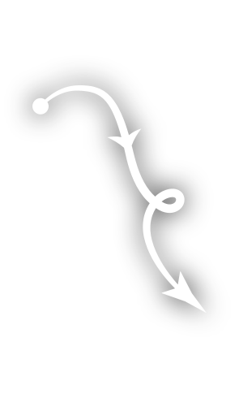<br/><sub>Fluid path preview included</sub></td>
    <td align="center"><b>Expelliarmus</b><br/>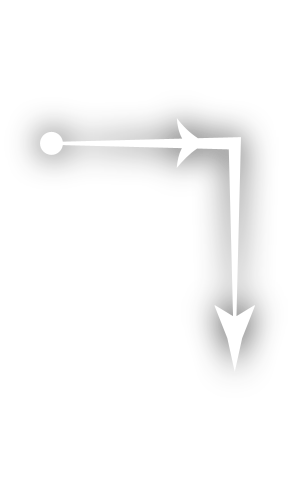<br/><sub>Fluid path preview included</sub></td>
    <td align="center"><b>Finite</b><br/>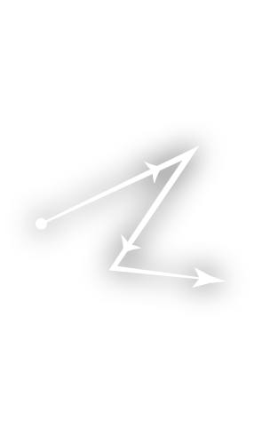<br/><sub>Fluid path preview included</sub></td>
    <td align="center"><b>Lumos</b><br/>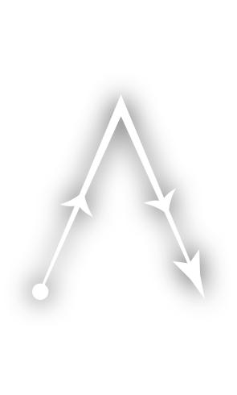<br/><sub>Fluid path preview included</sub></td>
  </tr>
  <tr>
    <td align="center"><b>Lumos Maxima</b><br/>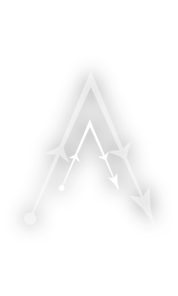<br/><sub>Fluid path preview included</sub></td>
    <td align="center"><b>Nox</b><br/>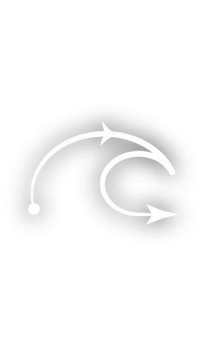<br/><sub>Fluid path preview included</sub></td>
    <td align="center"><b>Petrificus Totalus</b><br/>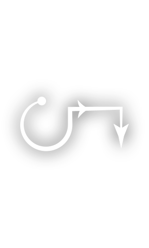<br/><sub>Fluid path preview included</sub></td>
    <td align="center"><b>Stupefy</b><br/>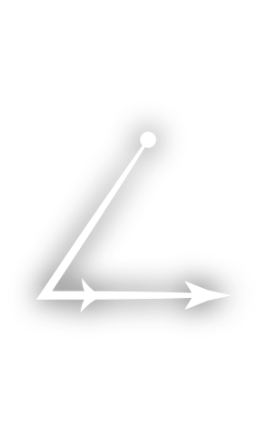<br/><sub>Fluid path preview included</sub></td>
  </tr>
  <tr>
    <td align="center"><b>Meteolojinx</b><br/>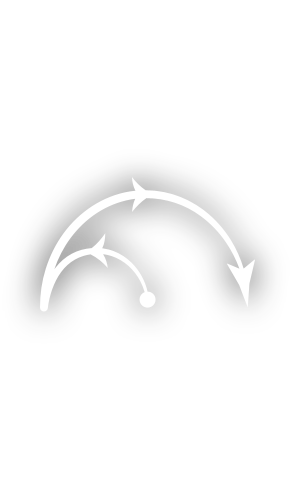<br/><sub>Fluid path preview included</sub></td>
    <td align="center"><b>Expecto Patronum</b><br/>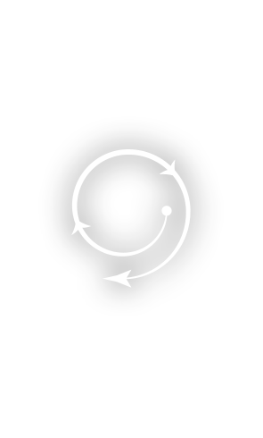<br/><sub>Fluid path preview included</sub></td>
    <td align="center"><b>Immobulus</b><br/>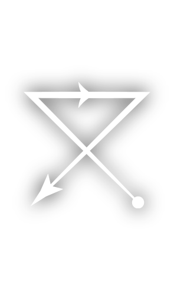<br/><sub>Fluid path preview included</sub></td>
    <td align="center"><b>Incendio</b><br/>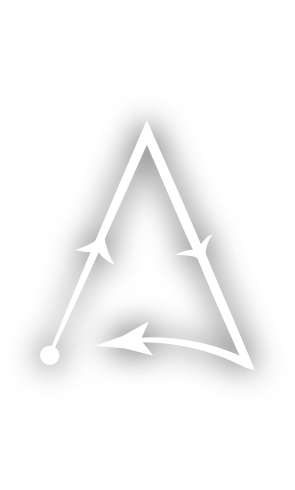<br/><sub>Fluid path preview included</sub></td>
  </tr>
  <tr>
    <td align="center"><b>Aguamenti</b><br/>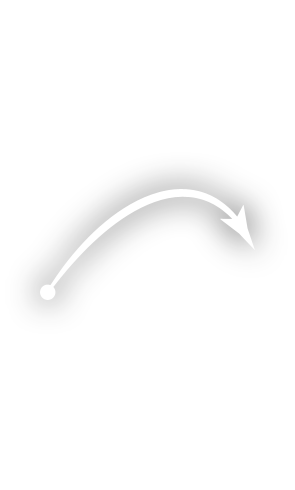<br/><sub>Fluid path preview included</sub></td>
    <td align="center"><b>Glacius</b><br/>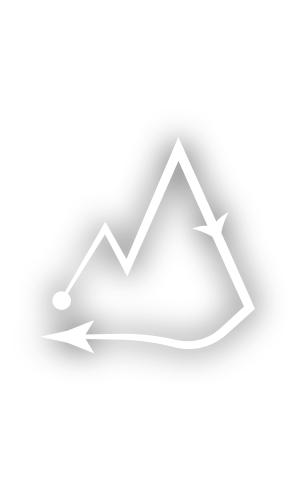<br/><sub>Fluid path preview included</sub></td>
    <td align="center"><b>Ascendio</b><br/>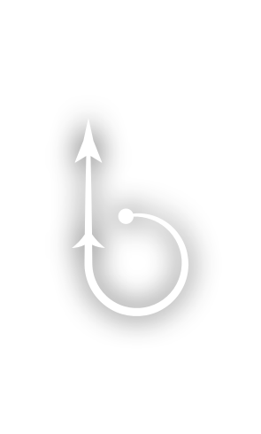<br/><sub>Fluid path preview included</sub></td>
    <td align="center"><b>Protego</b><br/>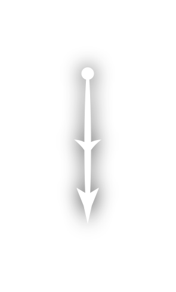<br/><sub>Fluid path preview included</sub></td>
  </tr>
  <tr>
    <td align="center"><b>Wingardium Leviosa</b><br/>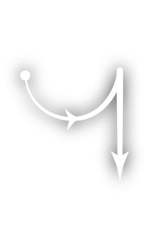<br/><sub>Fluid path preview included</sub></td>
    <td align="center"><b>Brachiabindo</b><br/>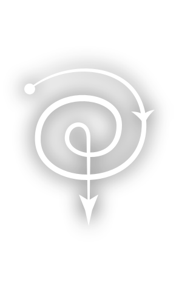<br/><sub>Fluid path preview included</sub></td>
    <td align="center"><b>Finestra</b><br/>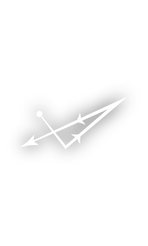<br/><sub>Fluid path preview included</sub></td>
    <td align="center"><b>Incarcerous</b><br/>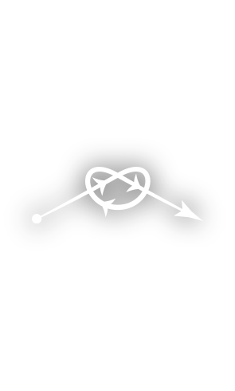<br/><sub>Fluid path preview included</sub></td>
  </tr>
  <tr>
    <td align="center"><b>Reparo</b><br/>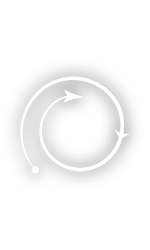<br/><sub>Fluid path preview included</sub></td>
    <td align="center"><b>Bombarda</b><br/>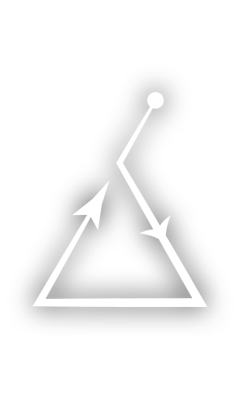<br/><sub>Fluid path preview included</sub></td>
    <td align="center"><b>Arania Exumai</b><br/>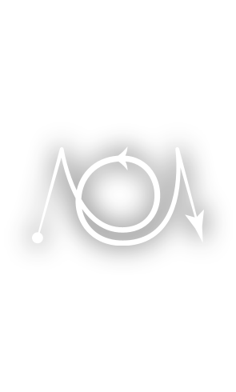<br/><sub>Fluid path preview included</sub></td>
    <td align="center"><b>Reducto</b><br/>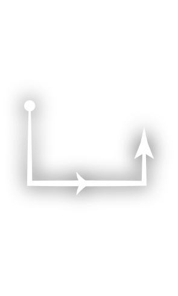<br/><sub>Fluid path preview included</sub></td>
  </tr>
  <tr>
    <td align="center"><b>Ventus</b><br/>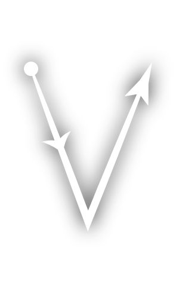<br/><sub>Fluid path preview included</sub></td>
    <td align="center"><b>Fulgari</b><br/>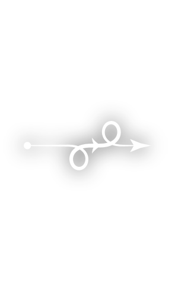<br/><sub>Fluid path preview included</sub></td>
    <td align="center"><b>Orchideous</b><br/>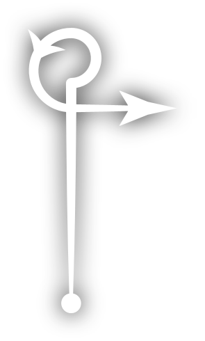<br/><sub>Fluid path preview included</sub></td>
    <td align="center"><b>Expulso</b><br/>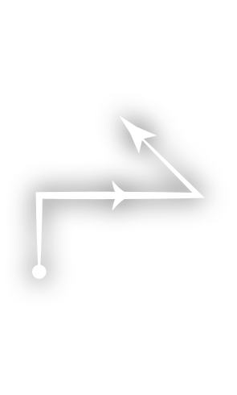<br/><sub>Fluid path preview included</sub></td>
  </tr>
  <tr>
    <td align="center"><b>Alohomora</b><br/>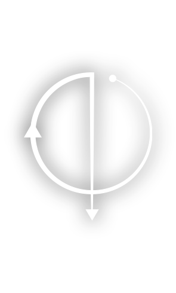<br/><sub>Fluid path preview included</sub></td>
    <td align="center"><b>Herbivicus</b><br/>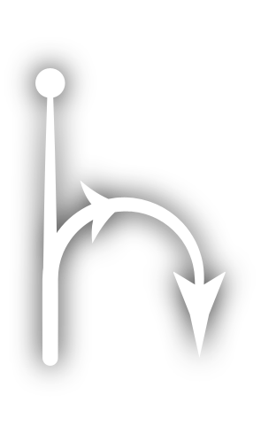<br/><sub>Fluid path preview included</sub></td>
    <td align="center"><b>Cantis</b><br/>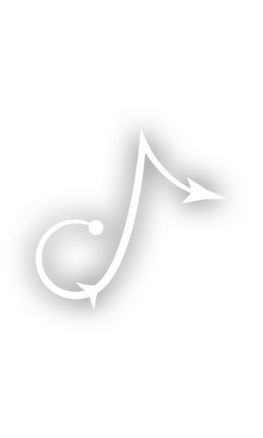<br/><sub>Fluid path preview included</sub></td>
    <td align="center"><b>Flagrate</b><br/>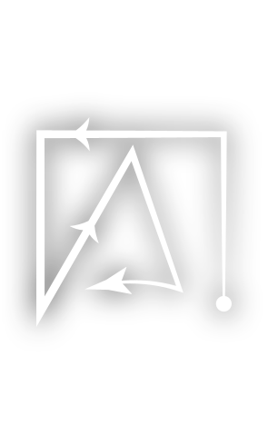<br/><sub>Fluid path preview included</sub></td>
  </tr>
  <tr>
    <td align="center"><b>Salvio Hexia</b><br/>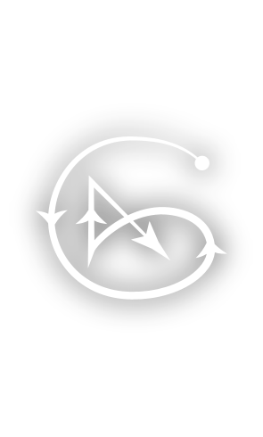<br/><sub>Fluid path preview included</sub></td>
    <td align="center"><b>Verdimillious</b><br/>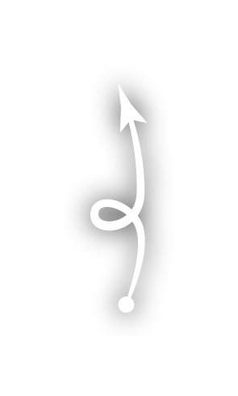<br/><sub>Fluid path preview included</sub></td>
    <td align="center"><b>Vermillious</b><br/>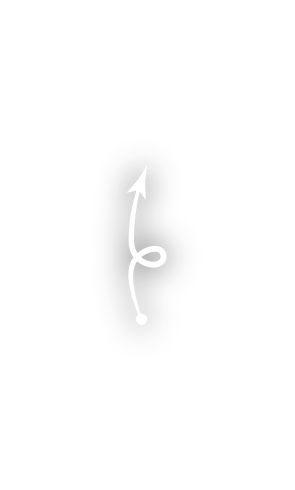<br/><sub>Fluid path preview included</sub></td>
    <td align="center"><b>Impedimenta</b><br/>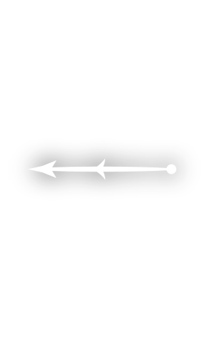<br/><sub>Fluid path preview included</sub></td>
  </tr>
  <tr>
    <td align="center"><b>Confundo</b><br/>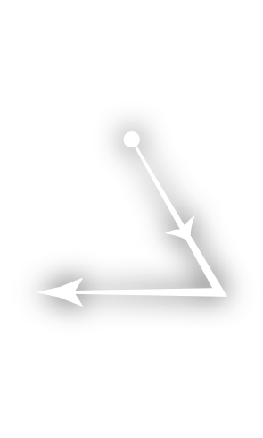<br/><sub>Fluid path preview included</sub></td>
    <td align="center"><b>Confringo</b><br/>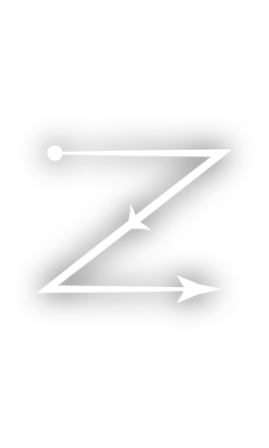<br/><sub>Fluid path preview included</sub></td>
    <td align="center"><b>Appare Vestigium</b><br/>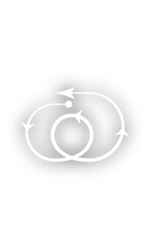<br/><sub>Fluid path preview included</sub></td>
    <td align="center"><b>Accio</b><br/>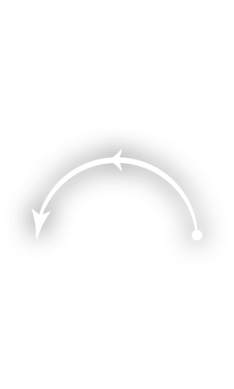<br/><sub>Fluid path preview included</sub></td>
  </tr>
  <tr>
    <td align="center"><b>Riddikulus</b><br/>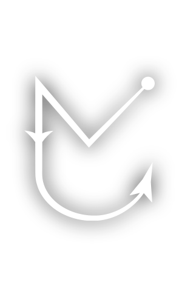<br/><sub>Fluid path preview included</sub></td>
    <td align="center"><b>The Force Spell</b><br/>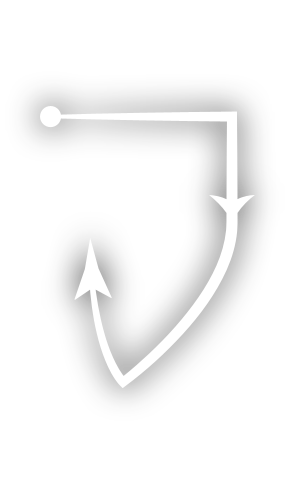<br/><sub>Fluid path preview included</sub></td>
    <td align="center"><b>Piertotum Locomotor</b><br/>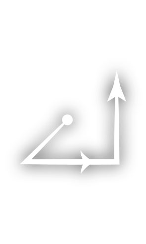<br/><sub>Fluid path preview included</sub></td>
    <td align="center"><b>Scourgify</b><br/>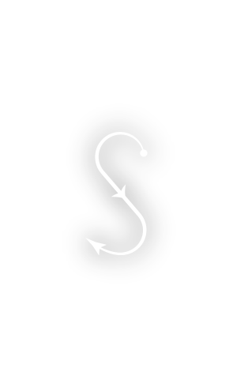<br/><sub>Fluid path preview included</sub></td>
  </tr>
  <tr>
    <td align="center"><b>Colloshoo</b><br/>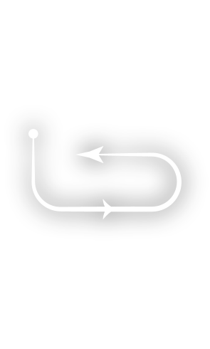<br/><sub>Fluid path preview included</sub></td>
    <td align="center"><b>Pestis Incendium</b><br/><br/><sub>Fluid path preview included</sub></td>
    <td align="center"><b>Flipendo</b><br/>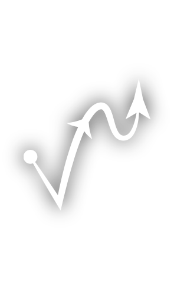<br/><sub>Fluid path preview included</sub></td>
    <td align="center"><b>Locomotor</b><br/><br/><sub>Fluid path preview included</sub></td>
  </tr>
  <tr>
    <td align="center"><b>Sonorus</b><br/><br/><sub>Fluid path preview included</sub></td>
    <td align="center"><b>Depulso</b><br/><br/><sub>Fluid path preview included</sub></td>
    <td align="center"><b>Everte Statum</b><br/><br/><sub>Fluid path preview included</sub></td>
    <td align="center"><b>Descendo</b><br/><br/><sub>Fluid path preview included</sub></td>
  </tr>
  <tr>
    <td align="center"><b>The Pepper-Breath Hex</b><br/><br/><sub>Fluid path preview included</sub></td>
    <td align="center"><b>Langlock</b><br/><br/><sub>Fluid path preview included</sub></td>
    <td align="center"><b>Spongify</b><br/><br/><sub>Fluid path preview included</sub></td>
    <td align="center"><b>Aberto</b><br/>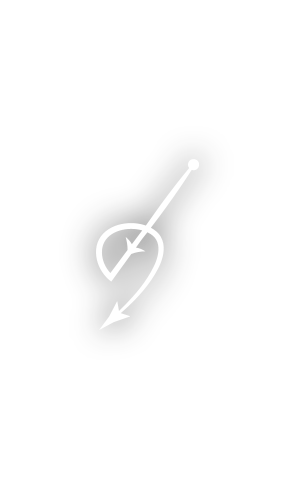<br/><sub>Fluid path preview included</sub></td>
  </tr>
  <tr>
    <td align="center"><b>Anteoculatia</b><br/>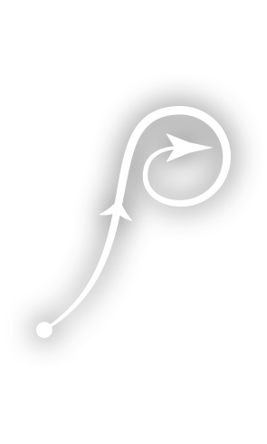<br/><sub>Fluid path preview included</sub></td>
    <td align="center"><b>Calvorio</b><br/>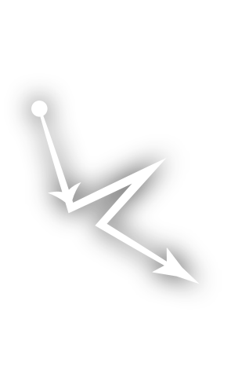<br/><sub>Fluid path preview included</sub></td>
    <td align="center"><b>Colloportus</b><br/>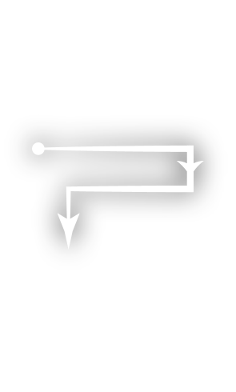<br/><sub>Fluid path preview included</sub></td>
    <td align="center"><b>Densaugeo</b><br/><br/><sub>Fluid path preview included</sub></td>
  </tr>
  <tr>
    <td align="center"><b>Entomorphis</b><br/><br/><sub>Fluid path preview included</sub></td>
    <td align="center"><b>Evanesco</b><br/><br/><sub>Fluid path preview included</sub></td>
    <td align="center"><b>Melefors</b><br/><br/><sub>Fluid path preview included</sub></td>
    <td align="center"><b>Mucus Ad Nauseum</b><br/><br/><sub>Fluid path preview included</sub></td>
  </tr>
  <tr>
    <td align="center"><b>Quietus</b><br/><br/><sub>Fluid path preview included</sub></td>
    <td align="center"><b>Revelio</b><br/><br/><sub>Fluid path preview included</sub></td>
    <td align="center"><b>Rictusempra</b><br/><br/><sub>Fluid path preview included</sub></td>
    <td align="center"><b>Silencio</b><br/><br/><sub>Fluid path preview included</sub></td>
  </tr>
  <tr>
    <td align="center"><b>The Cheering Charm</b><br/><br/><sub>Fluid path preview included</sub></td>
    <td align="center"><b>The Hair Thickening Growing Charm</b><br/><br/><sub>Fluid path preview included</sub></td>
    <td align="center"><b>The Hour Reversal Charm</b><br/><br/><sub>Fluid path preview included</sub></td>
    <td align="center"><b>The Sleeping Charm</b><br/><br/><sub>Fluid path preview included</sub></td>
  </tr>
  <tr>
    <td align="center"><b>The Stretching Jinx</b><br/><br/><sub>Fluid path preview included</sub></td>
    <td align="center"><b>Avada Kedavra</b><br/><br/><sub>Fluid path preview included</sub></td>
    <td></td>
    <td></td>
  </tr>
</table>

## Spell Recognition

Install the `hass-tflite` add-on and upload your compatible `model.tflite` through its web UI. Configure the TFLite server URL from the integration options if needed.

> The `model.tflite` file is not included publicly in this repository.

## References

- [Magic-Caster-Wand-Open-app-ai](https://github.com/whymaxwhy/Magic-Caster-Wand-Open-app-ai.git)
- [OpenCaster](https://github.com/Blues-Hailfire/OpenCaster.git)
- [Original hass-magic-caster-wand](https://github.com/eigger/hass-magic-caster-wand)
